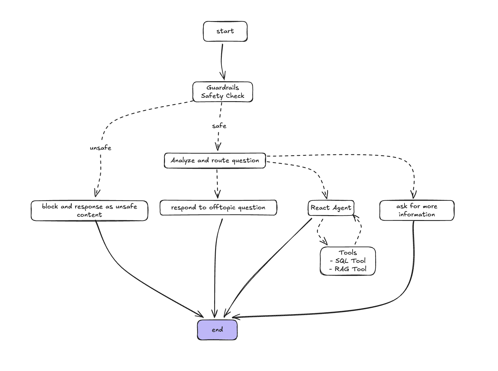
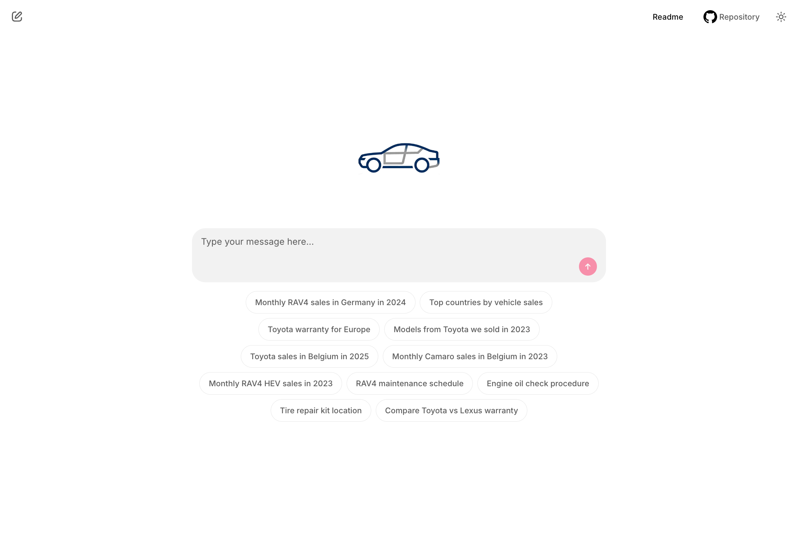
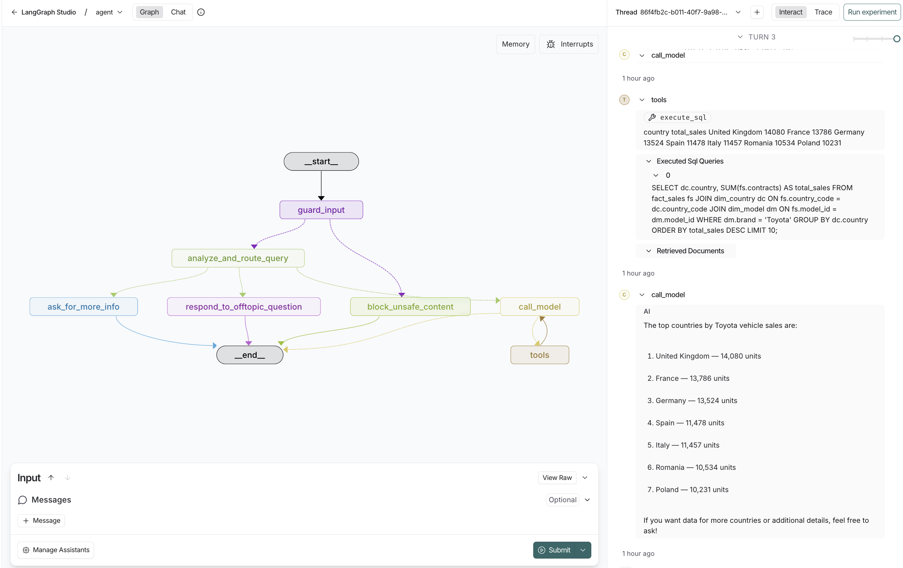

# Toyota/Lexus RAG Assistant

A RAG assistant that combines vehicle sales data and documents to answer automotive questions. Built with LangGraph, ChromaDB, and SQLite. LangSmith integration and ready for deployment with Docker.

## What it does

This assistant can:

- **Context-Aware Responses**: Handles Toyota-specific questions only
- **Query Sales Data**: Answers questions about vehicle sales using SQL database
- **Search Documents**: Finds relevant information in manuals, contracts, and warranty documents
- **Tool Orchestration**: Answers complex questions by combining different tools

You can run it locally or you can access the deployed version at [https://rag-reference-demo.onrender.com/](https://rag-reference-demo.onrender.com/).

## How it works

The assistant uses a multi-step LangGraph workflow with intelligent routing:

1. **Safety Check**: OpenAI Moderation API filters harmful content
2. **Query Analysis**: LLM classifies the question type and intent
3. **Context-Aware Routing**: Routes to appropriate response path:
   - **Toyota-specific**: Uses tools (SQL/documents) to answer
   - **Needs clarification**: Asks for more specific information
   - **Off-topic**: Politely redirects to Toyota/Lexus topics
4. **Agentic Tool Loop**: For Toyota questions, iterates between model and tools until complete




## Demo

### Basic Demo

Demo showing the agent using semantic search to find relevant documents.


### Sales Data Analysis Demo

Demo showing the agent using SQL capabilities to query the structured database.


## Quick Start

### Prerequisites

- **Option A (Docker)**: Docker and Docker Compose
- **Option B (Local)**: Python 3.11+ and OpenAI API key

### Option A: Docker Deployment (Recommended)

1. **Create environment file**
```bash
cp .env.example .env
# Edit .env and add your OPENAI_API_KEY
```

2. **Run with Docker Compose**
```bash
docker-compose up --build
```

3. **Or run with Docker directly**
```bash
# Build the image
docker build -f Dockerfile -t toyota-rag-assistant .

# Run with environment file
docker run -p 8000:8000 --env-file .env toyota-rag-assistant
```

### Option B: Local Development

1. **Install dependencies**
```bash
uv sync
```

2. **Set environment variable**
```bash
export OPENAI_API_KEY="your-openai-api-key-here"
```

3. **Setup databases**
```bash
make setup-db
```

4. **Run the app**
```bash
# Web interface
make run

# Development mode. This will open LangGraph Studio
make dev
```

### Access the Application

Visit `http://localhost:8000` to chat with the assistant.



## What's included

### Sample Data
- **Sales Data** (SQLite): Vehicle sales by model, country, and date
- **Documents** (LanceDB): Toyota manuals, contracts, and warranty policies

## Configuration

### Environment Variables

Create a `.env` file in the project root:

```bash
# Required
OPENAI_API_KEY=your-api-key
```

## Project Structure

```
src/
├── assistant/                                  # Core agent
│   ├── graph.py                                # LangGraph workflow
│   ├── tools.py                                # SQL and document search tools
│   ├── state.py                                # Agent state management
│   ├── context.py                              # Configuration
│   ├── prompts.py                              # System prompts
│   └── guardrails.py                           # Safety features
└── chainlit_app.py                             # Web interface

scripts/                                        # Database setup and ingestion scripts
├── structured_data_ingestion_pipeline.py       # Ingest structured data into SQLite
├── unstructured_data_ingestion_pipeline.py     # Ingest pdf documents into ChromaDB
data/                                           # Sample CSV data
docs/                                           # Sample PDF documents
```

## Try these questions

**Using structured sales data:**
- "What were the RAV4 sales in Germany in 2024?"
- "Show me the top countries by vehicle sales"

**Using unstructured documents:**
- "What is the Toyota warranty coverage?"
- "Where is the tire repair kit in the UX?"

**Hybrid:**
- "Compare RAV4 sales and summarize its warranty"

## Document Ingestion

### Local ChromaDB (Default)

Ingest PDF documents for semantic retrieval using ChromaDB.
This takes some time to parse the big documents.

```bash
# Ingest PDFs from ./docs directory
make setup-embeddings-db
```

### ChromaDB Cloud (Optional)

To use ChromaDB Cloud instead of local storage:

1. **Set up ChromaDB Cloud credentials** in your `.env` file:
   ```bash
   CHROMA_API_KEY=your-chroma-api-key
   CHROMA_TENANT_ID=your-tenant-id
   CHROMA_DATABASE_NAME=your-database-name
   ```

2. **Run ingestion** (same command, will auto-detect cloud config):

```bash
make setup-embeddings-db
```

The system automatically detects whether to use local or cloud ChromaDB based on the presence of `CHROMA_API_KEY`.

## Development

### Local Development

```bash
# Code quality
make lint format

# Debug mode
make dev  # Opens LangGraph Studio
```



## Troubleshooting

### Local Development Issues

**Database issues:**
```bash
make setup-db  # Recreate databases
```

---

**Built with**: Docker, OpenAI, LangGraph, ChromaDB, Chainlit


## Next Steps

- **Automated Evaluation**: Build evaluation pipeline for response quality and accuracy
- **Contextual Retrieval**: Better document chunking with improved summaries
- **Reranking**: Semantic reranking to improve document retrieval relevance
- **User Feedback**: Collect user feedback in the UI (thumbs up/down)
- **Query Suggestions**: Provide intelligent follow-up question recommendations
